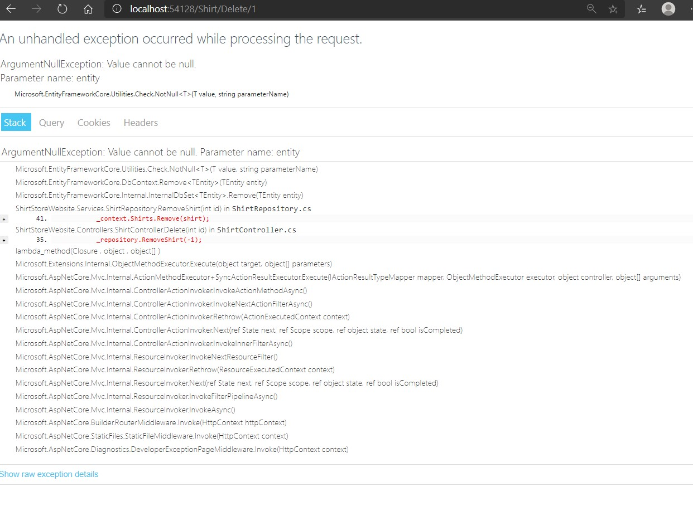
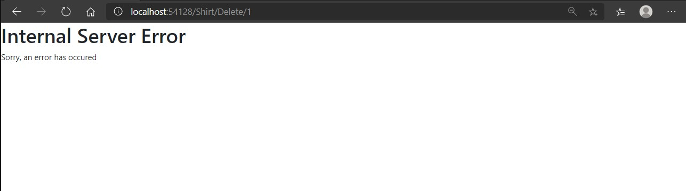

# Module 10: Testing and Troubleshooting

## Lab: Testing and Troubleshooting

1. **Nombres y apellidos:** Francisco Javier Moreno Quevedo
2. **Fecha:** 02/12/2020
3. **Resumen del Ejercicio:** implementar control de excepciones en el proyecto
4. **Dificultad o problemas presentados y como se resolvieron:** Ninguna

Ejercicio 4: Adding Exception Handling

- En el middleware definimos la pagina de error
- Creamos una excepcion en el controlador en la accion delete para probar 
- corremos la aplicacion en modo desarrollo y al pulsar en Delete falla mostrando la pagina definida en desarrollo

- corremos la aplicacion en modo produccion y al pulsar en Delete falla mostrando la pagina definida en produccion

  

- eliminamos la excepcion

